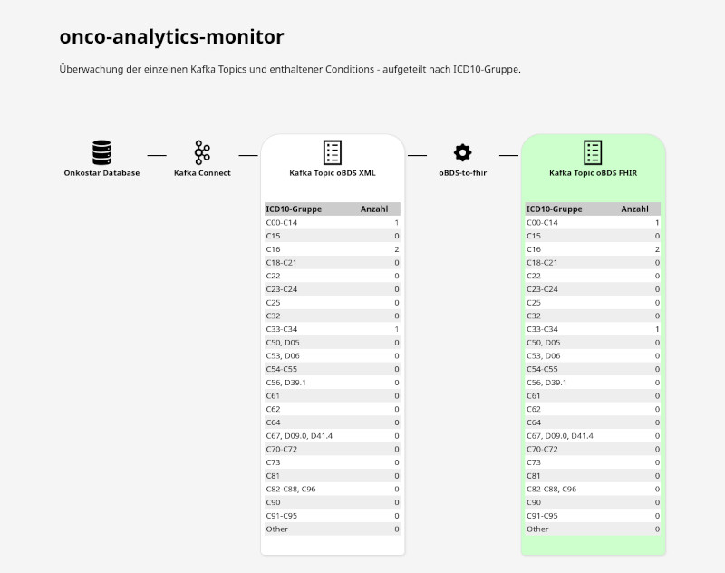

# onco-analytics-monitor

Diese Anwendung überwacht die konfigurierten Topics, ermittelt die Anzahl der Conditions nach ICD10-Gruppe sortiert
und zeigt diese in Echtzeit an.

Bei Änderungen wird die Tabelle des entsprechenden Topics kurz hervorgehoben.

## Datenquellen und Datenhaltung

Es wird keine Datenbank benötigt. Alle Informationen werden aus den Kafka Topics bezogen. Dabei werden beim Neustart der
Anwendung alle verfügbaren Records aus den Topics neu eingelesen, initiale Statistiken erstellt, welche bei neu
eingehenden Records aktualisiert werden.

### Aktuell überwachte Topics

Das `*` wird als Wildcard Match für ein beliebiges Jahr gemäß der Topics
in [onco-analytics-on-fhir](https://github.com/bzkf/onco-analytics-on-fhir) verwendet.

* `onkostar.MELDUNG_EXPORT.*`: Alle eingehenden Meldungen aus Onkostar
* `fhir.obds.Condition.*`: Alle Conditions, die aus den oBDS-Meldungen erzeugt wurden.
* `fhir.pseudonymized.*`: Alle pseudonymisierten Conditions.